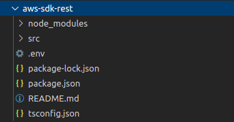

# AWS-SDK-REST 

This project works with ExpressJS in order to start a local server to be able to consume some exposed AWS-SDK functionalities as a rest API :metal:.

### Content
***
1. [Prerequisites](#prerequisites)
2. [Installation](#installation)
3. [Before run](#before-run)
4. [Run project](#run-project)
5. [API](#api)

### Prerequisites
***
This project uses the following:

* [Git](https://git-scm.com/downloads): version > 2.x
* [NodeJS](https://nodejs.org/): version > v12.x
* [npm](https://www.npmjs.com/): version > v6.x
* [TypeScript](http://typescriptlang.org/) version > v4.2.x

### Installation
***
Follow this steps for proper install:

```sh
$ git clone https://github.com/sanchezz985/aws-sdk-rest.git
$ cd /directory/where/project/was/cloned
$ npm install
``` 

### Before run
***
Before run the project you'll need to create the **.env** file, you can take this as an example:

> PORT=8000
> 
>ACCESS_KEY_AWS=XXXXXXXXXXXXXXXXXXXX
>
>SECRET_KEY_AWS=XXXXXXXXXXXXXXXXXXXXXXXXXXXXXXXXXXXXXXXX
>
>REGION=your-aws-region
>
>CLOUDWATCH_LOGS_VERSION=2014-03-28

Create the **.env** file in the root of the project.




### Run project

Run the next command

```sh
$ npm start
```

### API

At this moment the API have the following endpoints:

* [[GET] /v1/aws/cloudwatch/groups](#get-v1awscloudwatchgroups)
* [[GET] /v1/aws/cloudwatch/logs](#get-v1awscloudwatchlogs)

##### [GET] /v1/aws/cloudwatch/groups
Gets all cloudwatch groups in the aws account that you configured in the **.env** file.

**Request**

Param | type | example
--- | --- | ---
-- | -- | --

**Response**

Param | type | example
--- | --- | ---
logGroupName | String | /aws/test/LAMBDA-TEST
creationTime | String | 2021-04-06 10:53:01
arn | String | arn:aws:logs:region:account:log-group:/aws/test/LAMBDA-TEST: *
storedBytes | String | 1.18 MB

##### [GET] /v1/aws/cloudwatch/logs
Gets all logs in the aws account that you configured in the **.env** file, this logs are downloaded in the **/logs** folder which is created when you call this endpoint.

**Request**

Param | type | example
--- | --- | ---
groupName | queryParam | /aws/lambda/LAMBDA-TEST
startTime | queryParam | 2021/05/26 17:00:00
endTime | queryParam | 2021/05/26 24:00:00

**Response**

Param | type | example
--- | --- | ---
-- | -- | --